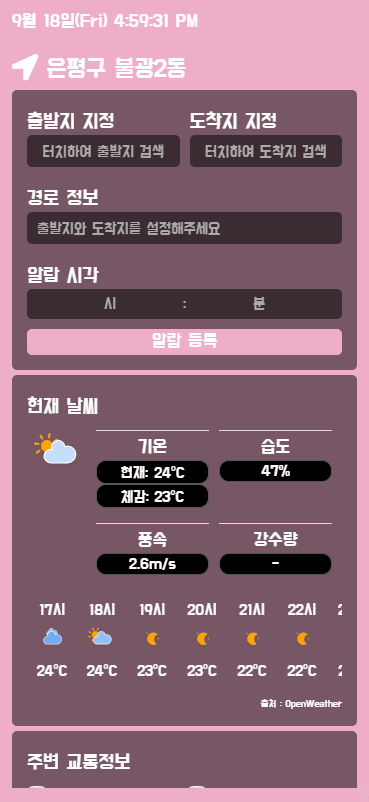

# PWA Weather Application 

## 사용된 기술 스택 및 개념

1. PWA
2. Vue.js
3. Node.js Express

## 개발 환경

- Mac OS X
- Visual Studio Code
- Google Android Chrome, Desktop Chrome

## 핵심 구현 내용

- Service Worker를 통해 불필요한 리소스 요청을 줄여보고자 했습니다.
- 웹을 앱처럼 사용할 수 있도록 해주는 PWA의 핵심 개념을 사용했습니다.
- 사용자가 지정한 알람 시각에 출발지로부터 도착지까지 가는 최적의 교통수단 정보를 Push 알람으로 제공합니다.

## 프로젝트 도메인
https://vue-pwa-cc9dd.web.app

